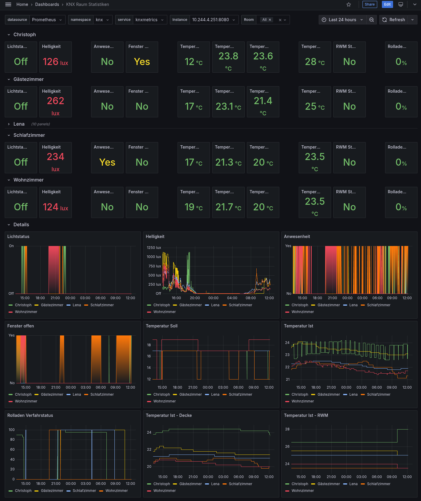

# knxmetrics

## Documentation

### Description

knxmetrics implements a webservice to expose KNX objects to scrapable prometheus
metrics by reading values from a KNX Bus through [knxrpc](https://github.com/choopm/knxrpc).

It requires a running `knxrpc server` and reads its config from a YAML-file.
You can find an example config at [knxmetrics.yaml](cmd/knxmetrics/knxmetrics.yaml).

By default it exposes your configured KNX values from the YAML-file
as prometheus metrics scrapable at <http://localhost:8080/metrics>.

You can visualize these metrics using prometheus+grafana to look like this:

You can choose to add metric attributes to group metrics.

It currently supports mapping these KNX DPTs to float64 gauges:

- *DPT 1xxx* mapped using DPT 1001 as 0 or 1
- *DPT 5001* mapped as percent 0..100%
- *DPT 9001* mapped as temperature C°
- *DPT 9004* mapped as Lux
- *DPT 9005* mapped as Speed m/s

Missing DPTs can be added in [func dispatchBusMessage](./knx.go).

## Development

### Dev container

Open this project in Visual Studio Code and select to reopen it inside a dev container.

*If you experience any issues, make sure your IDE supports dev containers:
<https://code.visualstudio.com/docs/devcontainers/containers>*

### Tasks

This project uses [task](https://taskfile.dev/).

Run `task --list` to list all available tasks.
